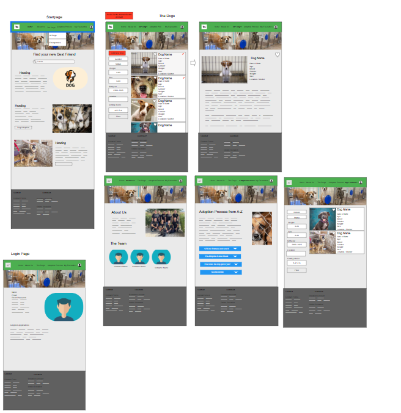
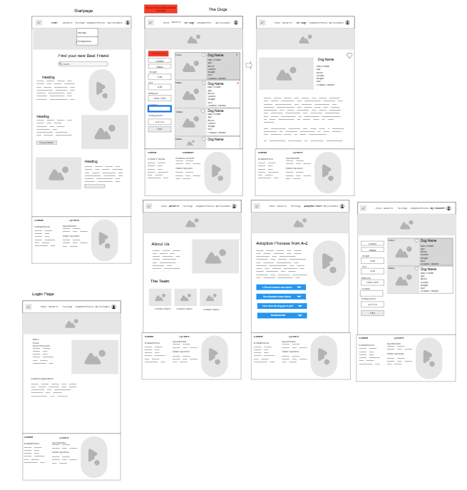
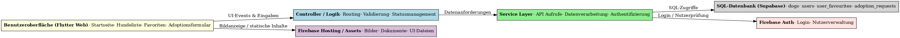

# CarmenWilliams_BMP4

Hundevermittlung Fur Real Friends

Mockup

Wireframe

1. [Projektbeschreibung](#projektbeschreibung)  
2. [User Stories](#user-stories)  
3. [Aufbau der Lösung](#aufbau-der-lösung)  
   3.1 [Komponentendiagramm](#komponentendiagramm)  
4. [User Interface Design](#user-interface-design)  
5. [Projektvorgehen](#projektvorgehen)  

#1	Projekbeschreibung**

Das Projekt „Fur Real Friend“ ist eine Webanwendung zur Hundeadoption, die mit Flutter für den Einsatz im Browser entwickelt wurde. Nutzer können Hundeprofile erfassen, durchstöbern und über ein integriertes Kontaktformular eine Adoptionsanfrage stellen. Die App bietet Funktionen zur Verwaltung von Hundeinformationen wie Rasse, Alter, Größe und Gesundheitszustand. Die Daten werden in einer SQL-Datenbank gespeichert und über moderne Dienste wie Firebase oder Supabase verwaltet. Ziel ist es, die Hundevermittlung online zugänglich, effizient und benutzerfreundlich zu gestalten.

- Das Projekt ist eine Website zur Hundevermittlung aus einem Tierheim. 
- Nutzer können Hunde nach verschiedenen Kriterien durchsuchen,
  speichern und eine Adoption beantragen.
- Tierheim kann neue Hunde hinzufügen und Adoptionen verwalten.

2	User Stories
Als Interessent möchte ich verfügbare Hunde durchsuchen, um den passenden Hund zu finden.
✅ Diese Funktion ist erfüllt. Über den UserDogManagerScreen kann man die vorhandenen Hundeprofile durchsuchen.

Als Nutzer möchte ich Hunde zu meinen Favoriten hinzufügen, um sie später wiederzufinden.
✅ Diese Funktion ist erfüllt. Die Favoritenfunktion ist vollständig implementiert und speichert die Daten persistent in der SQL-Datenbank.

Als Interessent möchte ich ein Formular ausfüllen, um einen Hund zu adoptieren.
✅ Diese Funktion ist erfüllt. Das Adoptionsformular ist direkt in die Benutzeroberfläche integriert und ermöglicht einfache Kontaktaufnahme.

Als Tierheim (Benutzer) möchte ich Hundeprofile erstellen und aktualisieren.
✅ Diese Funktion ist erfüllt. Im DogAdministration-Bereich können autorisierte Benutzer Hundeprofile verwalten. Adminrechte sind hierfür erforderlich.

Als Administrator möchte ich Adoptionen verwalten, um den Vermittlungsprozess zu erleichtern.
🔄 Diese Funktion ist teilweise erfüllt. Grundfunktionen sind vorhanden, jedoch kann je nach konkreter Umsetzung der Verwaltungsbereich noch erweitert werden (z. B. Statuswechsel, Kommunikation mit Interessenten, Filterung nach Anfragen).

3	Aufbau der Lösung

Die Lösung besteht aus folgenden Komponenten:
- Frontend: Flutter-App zur Benutzerinteraktion
- Backend: Firebase/Supabase-Dienste zur Authentifizierung und Datenhaltung
- Datenbank: Supabase-Datenbank mit Tabellen für Hunde und Rassen

Es wurde das MVC-Pattern verwendet, um eine klare Trennung zwischen Logik, Darstellung und Datenzugriff zu gewährleisten. REST-ähnliche Schnittstellen werden genutzt, um Daten zwischen Frontend und Backend auszutauschen.

3.1	Komponentendiagramm

4	User Interface Design

Das Design der Benutzeroberfläche ist für das Web ausgelegt und folgt den Richtlinien ergonomischer Usability. Die Zielgruppe sind allgemeine Tierinteressierte die einen Hund adoptieren möchten oder Hundevermittlungsstellen. Die App unterstützt Touch-Eingabe und ist für Android- und iOS-Geräte optimiert.

5	Projerktvorgehen

Das Projekt Fur Real Friend wurde iterativ umgesetzt. Zu Beginn wurden grundlegende Anforderungen analysiert und erste Ideen in Form von Wireframes und Skizzen festgehalten. Zur nutzerzentrierten Gestaltung kam der Design-Thinking-Ansatz zum Einsatz: Bedürfnisse und Perspektiven potenzieller Nutzergruppen (z. B. Familien, Senioren, Tierheimmitarbeiter) wurden in Personas überführt. Basierend darauf wurde die Benutzeroberfläche entworfen und in mehreren Zyklen verbessert.

Die technische Umsetzung erfolgte mit Flutter für Web, unterstützt durch Provider für State Management. Daten wurden über eine SQL-Datenbank (Supabase) verwaltet. Funktionen wie Favoriten, Hundeverwaltung und Adoptionsformular wurden modular implementiert. Das Projekt wurde laufend getestet und weiterentwickelt, mit besonderem Fokus auf Benutzerfreundlichkeit und klare Navigation.

 Wer sind die Personas der Lösung:

Sabrina (32) – Single, tierlieb
Sabrina lebt in der Stadt und wünscht sich einen Begleithund für ihren Alltag. Sie ist aktiv, verantwortungsbewusst und informiert sich gerne ausführlich, bevor sie eine Entscheidung trifft.

Familie Williams – Junge Familie mit zwei Kindern
Die Familie lebt im Grünen und sucht einen kinderfreundlichen Hund. Sie möchten gemeinsam Verantwortung übernehmen und ein neues Familienmitglied willkommen heißen.

Erika (70) – Seniorin, lebt allein
Erika sucht einen ruhigen, kleinen Hund als treuen Gefährten. Für sie sind ein liebevolles Wesen und ein entspannter Charakter besonders wichtig.

Eric (45) – Tierheim-Mitarbeiter
Eric arbeitet im Tierheim und betreut Hunde vor der Vermittlung. Er organisiert die Adoptionen und hält alle Informationen zu den Tieren aktuell.

 Wie interagiert der User mit der Lösung:

Durchsucht die Hundeliste mit Filterung,
Speichert Favoriten
Ruft detaillierte Hundebeschreibungen auf
Füllt das Adoptionsformular aus
Tierheime verwalten ihre Hundeprofile

e. Wie ist die Lösung in die täglichen Aktivitäten eingebunden:

Nutzer können jederzeit Hunde suchen und Adoptionen anfragen.
Tierheime können kontinuierlich neue Hunde hochladen und Anfragen bearbeiten.

Wiso haben sie dieses Design gewählt:

Ich habe dieses Design gewählt,
weil es Vertrauen und Ruhe ausstrahlt –
genau das, was ich für meine Hundevermittlung vermitteln möchte.
Die Kombination aus Grün für Natur und Sicherheit,
und Grau für Professionalität schafft eine beruhigende Atmosphäre.
Ich habe das Design so übersichtlich wie möglich gemacht das auch Leute die nicht IT affine sind klar kommen mit der Website und Schritt für Schritt Anleitungen haben wen es um den Addoptionsprozess geht.

